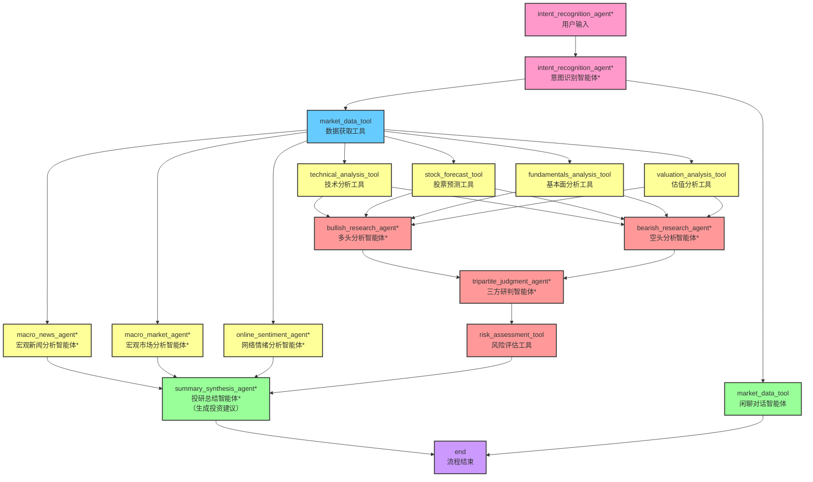
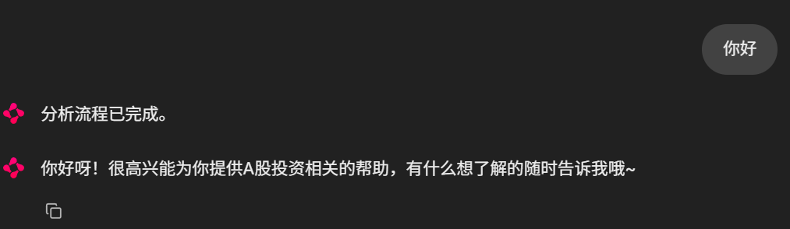
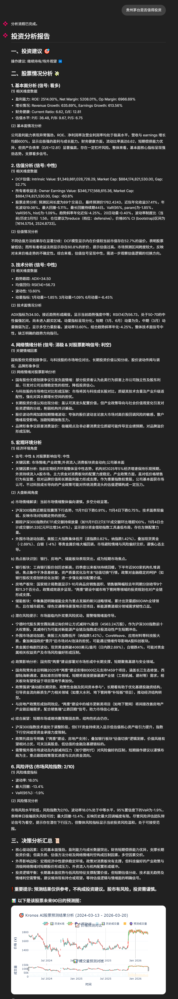

# 🤖 SignalAI (AI投研团队)


## 📖 项目介绍

### 项目概述

这是一款**聚焦 AI 辅助智能投研分析决策的团队“SignalAI”**，以用户自然语言需求为核心切入点，精准识别用户投资意图与自身情况。它既立足股票价格预测、技术面指标、基本面数据、宏观估值等核心**数值类信息**展开量化分析，又依托大型语言模型（LLM）的深度推理能力，从看多、看空双重视角进行**辩证研判**；同时整合市场情绪动态、个股相关新闻、宏观经济概况等**文本类信息**，通过多 Agent 协同联动的高效工作模式，**为用户输出全面、立体的市场解读与针对性投资建议**。

### 项目特色

- **多智能体协作的模块化架构**：项目基于 LandGraph 框架，实现多智能体工作流的模块化构建。

  - 各模块之间相互联系：确保模型推理结果、工具执行结果等中间变量在智能体之间顺畅传播；
  - 各模块之间相互独立，各 Agent 独立运作，易于扩展和维护。

- **大语言模型推理分析**：依托大型语言模型（LLM）的深度推理能力进行研判。

  项目在多头分析、空头分析、宏观分析、情绪分析、报告分析等节点引入大预言模型（LLM），结合 Prompt Engineering 技术，引导大模型进行投资决策的深度推理分析，确保分析的全面性与专业性。

- **多元数据的有效整合**：兼顾分析数据的实时多元性和投资观点的多元兼容性。

  - 多源头获取实时数据
    - 历史核心数据：通过 akshare 接口获取财务指标、市值数据、股价走势、财经新闻等核心历史数据与信息；
    - 未来趋势数据：基于股票K线预测大模型 Kronos 分析股票未来走势情况，基于 DCF 模型估算股票的内在价值；
    - 网络文本数据：通过爬虫技术获取百度贴吧投资者发布的帖子内容与评论信息等文本信息。
  - 多角度观点的辨证兼容
    - 多头分析智能体：放大正面数据信号，将其定义为核心增长动力，并将负面信号重构为乐观解读，最终通过 LLM 的深度推理形成信息度与若干个看多论点（包含预测机会点）；
    - 空头分析智能体：放大负面数据信号，将其定义为核心风险因素，并将正面信号重构为悲观解读，最终通过 LLM 的深度推理形成信息度与若干个看空论点（包含潜在风险点）；
    - 第三方辨证研判：整合多头与空头分析智能体的观点，站在客观的第三方立场评估并综合双方论点，避免模型有看多或看空倾向，最终输出平衡的投资结论建议。

- **投资建议内容充实**：投资报告结合数据支撑多角度论据，体现合理性与专业性。

  最终通过 LLM 生成的投资建议报告不仅给出了具体的决策结论和动作，还提供充分的决策依据，即一方面，结合数据指标从基本面、估值、技术面等多维度量化分析；另一方面结合网络文本数据从市场宏观与情绪角度呈现详实论证。

### 系统架构

> \* 标注的智能体表示接入大型语言模型（LLM）进行深度推理分析




## 📂 项目结构

```
SignalAI/
├── data/                                               # 存储缓存数据
├── src/
│   ├── Crawl_Comments/                                 # 爬虫代码文件
│   ├── Kronos/                                         # 股票走势预测金融模型
│   ├── agents/                                         # 各维度分析智能体
│   │   ├── __init__.py
│   │   ├── bearish_research.py
│   │   ├── bullish_research.py
│   │   ├── fundamentals.py
│   │   ├── intent_recognition.py
│   │   ├── macro_market.py
│   │   ├── macro_news.py
│   │   ├── market_data.py
│   │   ├── online_sentiment.py
│   │   ├── risk_assessment.py
│   │   ├── state.py
│   │   ├── stock_forecast.py
│   │   ├── summary_synthesis.py
│   │   ├── technicals.py
│   │   ├── tripartite_judgment.py
│   │   └── valuation.py
│   └── tools/                                        # 工作流涉及文件
├── .env.example                                       # 环境配置示例
├── chainlit_app.py                                # 前端文件
├── main.py                                        # 工作流涉及文件
├── .gitignore
├── LICENSE
├── README.md
└── requirements.txt
```


## 🛠️ 使用指南

### 1. 创建环境

- **环境要求**

  - **操作系统**: Windows、Linux、MacOS
  - **Python版本**: 3.12
  - **Conda**: Anaconda 或 Miniconda

- **创建环境**

  - 使用 conda

    ```
    # 创建conda环境
    conda create -n your_conda_name python=3.12
    conda activate your_conda_name
    ```

  - 使用 uv

    ```
    # 创建uv环境
    uv venv --python 3.12
    ```

- **安装依赖包**

  ```
  # 基础依赖安装
  pip install -r requirements.txt
  # uv版本命令
  uv pip install -r requirements.txt
  ```

- **安装浏览器内核**

  ```
  playwright install chromium
  ```

### 2. 加载 Kronos 模型

加载 Kronos 模型，用于后续股票走势预测，默认存储路径为“C:/用户/.cache/modelscope/hub/models/AI-ModelScope/xxx”

```bash
modelscope download --model AI-ModelScope/Kronos-Tokenizer-base
modelscope download --model AI-ModelScope/Kronos-base
```

### 3. 参考 .env.example 填写配置

将 .env.example 文件复制后重命名为 .env 文件，并修改里面的配置

```
# 字节跳动 API 配置
BYTEDANCE_API_KEY = your_api_key
BYTEDANCE_MODEL = your_model
BYTEDANCE_BASE_URL = your_base_url

# LangSmith 配置
LANGSMITH_API_KEY = your_langsmith_api_key
LANGSMITH_TRACING = true
LANGSMITH_PROJECT = your_langsmith_project_name
LANGCHAIN_ENDPOINT = https://api.smith.langchain.com

# 加载 Kronos 模型的绝对路径
KRONOS_MODEL_PATH="C:/Users/xx/.cache/modelscope/hub/models/AI-ModelScope/Kronos-base"
KRONOS_TOKENIZER_PATH="C:/Users/xx/.cache/modelscope/hub/models/AI-ModelScope/Kronos-Tokenizer-base"
```

### 4. 模型运行

```
chainlit run src/chainlit_app.py  # 注意这里应是 chainlit_app.py 的相对路径
```

在终端运行代码成功后，访问地址 http://localhost:8000，进入界面后在对话框输入需要咨询的问题即可。


**特别说明**：由于项目涉及百度贴吧相关帖子及其评论内容的爬取，用于网络情绪分析，因此【首次使用】时会有弹窗弹出百度贴吧登录二维码，届时需要用【百度贴吧手机APP客户端】进行扫码登录，请提前下再准备。

### 5. **示例输出**

- **简单回复**

  

- **股票投研分析**

  

